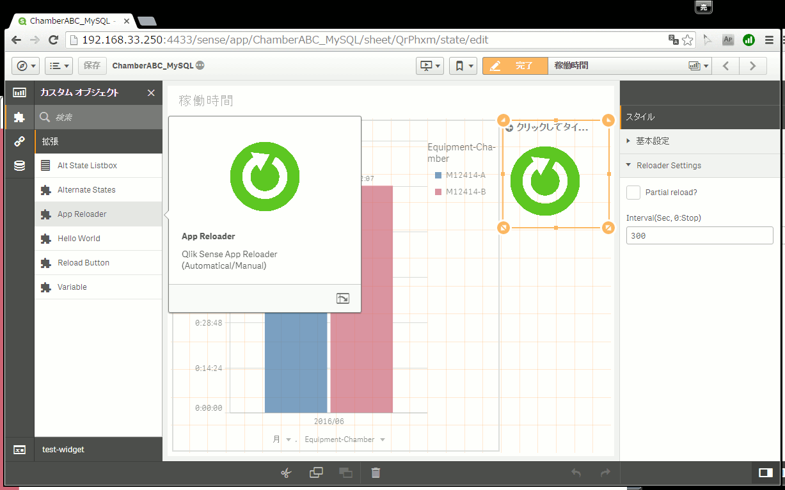

App Reloader for Qlik Sense

## Updated
2016/11/13
- Newly released.

====
This extension calls "[doReload](https://google.com/search?q=qlik+sense+doreload)" method of Qlik Sense automatically with some interval (default: 300 sec) or pressing a button manually.

## Install

### Qlik Sense Desktop   
Unzip the downloaded zip file into "C:\Users\%USERNAME%\Documents\Qlik\Sense\Extensions\" folder with directory name "Qlik-Sense-Reloader".

This extension was tested only on Qlik Sense Desktop,
because I don't have Qlik Sense Server nor Cloud.

If you get "Access is denied." on the Qlik Sense Server,
please refer the document of [Qlik Sense Reload Button](http://branch.qlik.com/#!/project/56728f52d1e497241ae69836)
and add a security rule on QMC.

## Settings

This extension has 2 settings on the right panel.

1. isPartial (default: false): reloading the application with "partial reload" optoin
1. Interval (default: 300 sec): automatically reloading interval. "0" means stopping to the auto reloading.

You can click the green button to do "force reload" manually.

## Licence
The software is provided "AS IS" without warranty of any kind. This project is licensed under the terms of the MIT license.

## Acknowledgement

I'm deeply graceful to Mr. Masaki Hamano,
who published [Qlik Sense Reload Button](http://branch.qlik.com/#!/project/56728f52d1e497241ae69836).

## Author
Ryo UMEZU